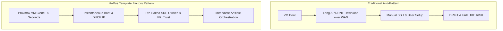

# 00 — HoRus Template Factory Philosophy & Core Architectural Principles

The **HoRus Template Factory** pattern is a foundational pillar of the **HoRus-Start** Infrastructure-as-Code (IaC) ecosystem. This document details the engineering principles, architectural rationale, and design goals behind baking pre-configured infrastructure templates.

---

## 🏛️ The Core Philosophy

In modern enterprise infrastructure, virtual machine and container provisioning must be **deterministic, instantaneous, and zero-touch**. 

Relying on post-creation manual configuration or downloading hundreds of packages during VM boot leads to **configuration drift, non-deterministic deployments, extended provisioning times, and high failure rates**.

For formal architecture decision records supporting these choices, refer to [ADR-0001: HoRus Template Factory Architecture](../adr/ADR-0001-template-factory.md) and [21-day0-day1-day2.md](./21-day0-day1-day2.md).

---

## 🎯 Key Engineering Objectives

### 1. Deterministic Reproducibility
Every virtual machine or LXC container spawned from a HoRus Template Factory image produces an **identically configured baseline**. Operating system packages, kernel modules, systemctl services, and configuration files are frozen at template creation time.

### 2. Zero Manual Post-Configuration
No human administrator should ever need to log into a newly spawned VM to run `apt update`, install `curl`, copy an SSH key, or configure `/etc/sudoers`. Day-0 provisioning is 100% automated.

### 3. Immediate Ansible / CI-CD Readiness
Every Template Factory image contains pre-baked automation credentials (`jenkins-srv` user with passwordless `sudo` and pre-configured Ed25519 SSH public keys). Ansible playbooks can execute against a newly cloned instance within **5 seconds** of boot. See [ADR-0004: SSH Authentication](../adr/ADR-0004-ssh-key-authentication.md).

### 4. Enterprise PKI Trust
The internal Infrastructure Root CA certificate is baked directly into the OS trust store (`/usr/local/share/ca-certificates/`). New instances immediately trust internal services (Harbor, Vault, Gitea, Jenkins) over TLS without `curl -k` hacks or SSL verification errors. See [15-pki.md](./15-pki.md) and [ADR-0005](../adr/ADR-0005-pki-trust-distribution.md).

### 5. Strict User & Privileged Socket Isolation
Human administrative access (`abbenden-srv`), automation execution (`jenkins-srv`), and daemon runtime processes (`docker-srv`) operate under strictly segregated user accounts and ACLs. The Docker UNIX socket is never exposed to unprivileged users or un-audited admin accounts. See [ADR-0002: Docker User Isolation](../adr/ADR-0002-docker-user-isolation.md).

### 6. Accelerated Provisioning Performance
By pre-installing all SRE core packages and container runtimes, VM instantiation time drops from **3–5 minutes** (downloading packages over WAN) down to **3–10 seconds** (instantaneous disk clone on local NVMe/SSD storage).

---

## 🔄 The Immutable Infrastructure Principle

HoRus Templates adhere to the **Immutable Template** doctrine:

1. **Templates Are Immutable**: Once a VM is converted to a Proxmox Template (`qm template`), it is frozen.
2. **Never Patch Live Templates**: If a package requires updating or a security patch is issued, **do not attempt to un-template and modify the existing instance**.
3. **Rebuild From Source**: Always execute a fresh build cycle, validate the candidate image against the [Release Checklist (22-release-checklist.md)](./22-release-checklist.md), assign a new semantic version tag, and decommission the old template version. See [13-recovery.md](./13-recovery.md).
