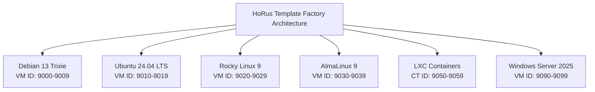

# 01 — HoRus Template Factory Prerequisites & Multi-OS Baseline

Before assembling templates in the **HoRus Template Factory** (VM ID 9000, 9001, LXC containers, and multi-OS targets), ensure that all infrastructure prerequisites, ISO assets, PKI certificates, and SSH key pairs are prepared.

---

## 📋 Hardware & Hypervisor Requirements

| Requirement | Specification | Architectural Purpose |
| :--- | :--- | :--- |
| **Proxmox VE Host** | Proxmox VE 8.x or 9.x | Active cluster node with internet access for initial package downloads |
| **PVE Storage** | `storage-hdd` or `storage-infra` | Target directory or LVM-thin storage registered during Stage 4 |
| **Network** | `vmbr0` Linux Bridge | DHCP server active (e.g., Keenetic gateway) for initial installation IP allocation |

---

## 🌐 Multi-OS Architecture Scope

While Debian 13 (Trixie) serves as the primary tier-1 operating system for HoRus-Start, the Template Factory specification supports a multi-distro enterprise environment partitioned by deterministic VM ID ranges (see [ADR-0007](../adr/ADR-0007-vm-id-allocation-scheme.md)):

---

## 💿 Required Installation Media (Stage 5 Catalog)

The required ISO files and container templates are downloaded and verified during **Stage 5 (Asset Preparation & Validation)**:

### Linux ISO & LXC Assets
- **Debian 13 (Trixie) Netinst ISO**: `/mnt/pve/storage-infra/template/iso/debian-testing-amd64-netinst.iso`
- **Ubuntu 24.04 LTS Server ISO**: `/mnt/pve/storage-infra/template/iso/ubuntu-24.04-live-server-amd64.iso`
- **Rocky Linux 9 Minimal ISO**: `/mnt/pve/storage-infra/template/iso/Rocky-9-latest-x86_64-minimal.iso`
- **AlmaLinux 9 Minimal ISO**: `/mnt/pve/storage-infra/template/iso/AlmaLinux-9-latest-x86_64-minimal.iso`
- **LXC Base Templates**:
  - `debian-13-default_amd64.tar.zst`
  - `ubuntu-24.04-standard_amd64.tar.zst`
  - `alpine-3.20-default_amd64.tar.xz`

---

## 👤 Administrative & Automation Account Matrix

For comprehensive identity standards and privilege rules, see [19-naming.md](./19-naming.md) and [23-security-matrix.md](./23-security-matrix.md):

| Username | Primary Role | Authentication Method | Sudo Privileges | Socket Access |
| :--- | :--- | :--- | :--- | :--- |
| `root` | System Kernel | LOCKED (Empty Password) | Full System Root | Full Access |
| `abbenden-srv` | Human Admin | Ed25519 SSH Key Only | Passworded Sudo | `docker` group excluded |
| `jenkins-srv` | Ansible / CI/CD | Ed25519 SSH Key Only | `NOPASSWD: ALL` | `docker` group allowed |
| `docker-srv` | Docker Daemon | No Login / No Password | None | `docker` group allowed |

---

## 🔐 Required SSH Keys & PKI Certificates

Ensure the following SSH key pairs exist on your administrator workstation before commencing installation (see [07-ssh-keys.md](./07-ssh-keys.md) and [15-pki.md](./15-pki.md)):

1. **Administrator SSH Key (`id_ed25519`)**:
   - Location: `%USERPROFILE%\.ssh\id_ed25519` (Windows) or `~/.ssh/id_ed25519` (Linux/macOS)
   - Usage: Passwordless SSH login for `abbenden-srv`.

2. **Automation / Jenkins SSH Key (`id_ed25519_jenkins`)**:
   - Location: `%USERPROFILE%\.ssh\id_ed25519_jenkins`
   - Comment: `ansible-deployment-key`
   - Usage: Dedicated SSH key for Ansible playbooks executing as `jenkins-srv`.

3. **Infrastructure CA Certificate (`internal-ca.crt`)**:
   - Internal Root CA for HTTPS/TLS trust across local infrastructure services (Vault, Harbor, Gitea, Jenkins). See [ADR-0005](../adr/ADR-0005-pki-trust-distribution.md).
