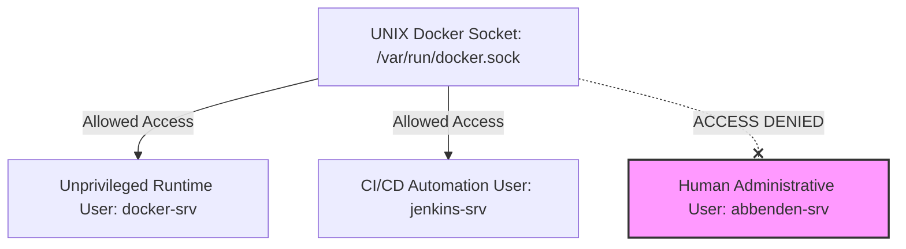

# 03 — Docker Engine Template (VM ID 9001) & Production Daemon Architecture

This guide details the step-by-step creation of **Template ID 9001 (`debian-13-trixie-docker`)** by cloning the base Template 9000 and configuring Docker CE container runtime environment with strict socket isolation and enterprise `/etc/docker/daemon.json` performance tuning.

---

## 🔒 User Isolation Architecture



For formal rationale behind Docker user isolation, see [ADR-0002: Docker Daemon Socket Security](../adr/ADR-0002-docker-user-isolation.md) and [23-security-matrix.md](./23-security-matrix.md).

---

## Step 1: Full Clone from Base Template 9000

In Proxmox VE Web UI:
1. Right-click **Template 9000 (`debian-13-trixie-base`)** ➔ Click **Clone**.
2. Specify parameters:
   - Mode: **Full Clone**
   - Target Storage: `storage-hdd` (or `storage-infra`)
   - VM ID: `9001`
   - Name: `debian-13-trixie-docker`
3. Click **Clone**.
4. Power on VM 9001 and log in via SSH as `abbenden-srv`.

---

## Step 2: Set Hostname & Install Docker CE

```bash
# Set hostname
sudo hostnamectl set-hostname holab-tpl-docker

# Download and execute official Docker CE installation script
curl -fsSL https://get.docker.com -o get-docker.sh
sudo sh get-docker.sh
rm -f get-docker.sh
```

---

## Step 3: Production `/etc/docker/daemon.json` Architecture

To prevent disk exhaustion, subnet collision, daemon downtime during updates, and uncontrolled logging, configure the production `/etc/docker/daemon.json` manifest:

```json
{
  "log-driver": "json-file",
  "log-opts": {
    "max-size": "10m",
    "max-file": "3"
  },
  "exec-opts": [
    "native.cgroupdriver=systemd"
  ],
  "live-restore": true,
  "userland-proxy": false,
  "no-new-privileges": true,
  "default-address-pools": [
    {
      "base": "172.20.0.0/14",
      "size": 24
    }
  ],
  "registry-mirrors": [
    "https://mirror.gcr.io"
  ]
}
```

### Architectural Breakdown of Daemon Settings

| Parameter | Value | Engineering Rationale |
| :--- | :--- | :--- |
| **`log-driver`** | `json-file` | Standardized log driver compatible with Fluent Bit log tailing and `docker logs`. |
| **`log-opts.max-size`** | `10m` | Limits individual container log files to 10 MiB, preventing unbounded disk growth. |
| **`log-opts.max-file`** | `3` | Retains a maximum of 3 rotated log files per container (30 MiB ceiling per container). |
| **`native.cgroupdriver`**| `systemd` | Aligns Docker cgroup management with systemd, preventing resource contention. |
| **`live-restore`** | `true` | Allows containers to remain running even if the Docker daemon restarts or upgrades. |
| **`userland-proxy`** | `false` | Disables the memory-heavy `docker-proxy` process, routing traffic via `iptables` directly. |
| **`default-address-pools`**| `172.20.0.0/14` | Avoids Docker default `172.17.0.0/16` subnet collisions with enterprise LANs. |
| **`registry-mirrors`** | `mirror.gcr.io` | Fallback mirror for Docker Hub rate-limiting and DPI filtering resilience. |

Apply configuration:

```bash
sudo mkdir -p /etc/docker
sudo nano /etc/docker/daemon.json
# Paste json content above
sudo systemctl daemon-reload
sudo systemctl restart docker
```

---

## Step 4: SRE Socket Isolation Architecture

> 🔒 **Security Best Practice**: The administrative user `abbenden-srv` is **NOT** added to the `docker` group. Adding administrative users to the `docker` group grants un-audited root equivalent access. Instead, container execution is strictly isolated to the unprivileged service user `docker-srv` and automation account `jenkins-srv`.

```bash
# 1. Add docker-srv user to docker socket group
sudo usermod -aG docker docker-srv

# 2. Add jenkins-srv user to docker group (Allows Ansible / CI pipelines to build containers)
sudo usermod -aG docker jenkins-srv

# 3. Explicitly ensure admin user abbenden-srv is NOT in docker group
sudo deluser abbenden-srv docker 2>/dev/null || true

# 4. Enable Docker systemd services
sudo systemctl enable docker.service
sudo systemctl enable containerd.service
```

---

## Step 5: Test Isolated Execution

```bash
sudo -u docker-srv docker run hello-world
```

---

## Step 6: Final SRE Sterilization & Template Freeze

For complete candidate verification rules prior to freezing, see [18-audit.md](./18-audit.md) and [22-release-checklist.md](./22-release-checklist.md):

```bash
# 1. Remove hello-world test container and prune unreferenced resources
sudo docker rm -f $(sudo docker ps -a -q) 2>/dev/null || true
sudo docker rmi -f hello-world 2>/dev/null || true
sudo docker system prune -a -f --volumes

# 2. Clean APT cache and logs
sudo apt clean
sudo find /var/log -type f -exec truncate -s 0 {} \;

# 3. Reset Machine ID
sudo truncate -s 0 /etc/machine-id
sudo rm -f /var/lib/dbus/machine-id
sudo ln -s /etc/machine-id /var/lib/dbus/machine-id

# 4. Clear bash history and power down
history -c && history -w && sudo poweroff
```

In Proxmox VE Web UI: Right-click VM 9001 ➔ Click **Convert to Template**.
