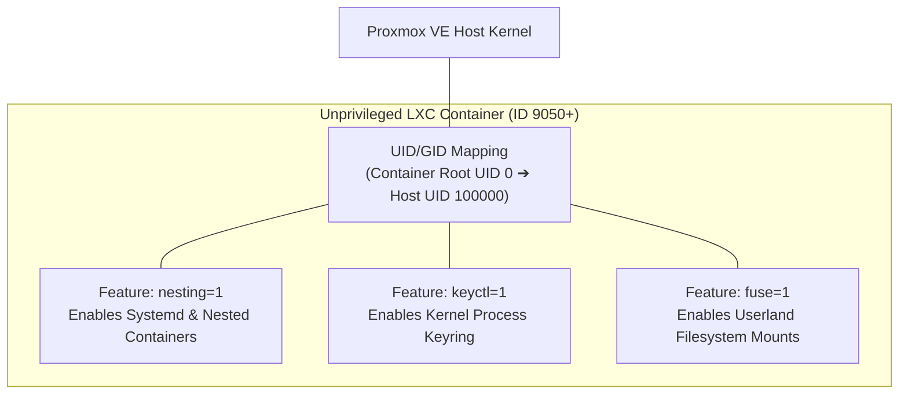

# 04 — LXC Container Templates & Deep Feature Configuration

LXC (Linux Containers) offer OS-level virtualization with near-zero memory and CPU overhead. In the **HoRus-Start** architecture, LXC containers are used for lightweight infrastructure workloads (DNS, Vault, Gitea, Monitoring agents).

This document details LXC container security models, feature flags (`nesting`, `fuse`, `keyctl`), and template pre-baking.

---

## 🛡️ LXC Security & Feature Architecture



For formal architecture decisions regarding LXC container security, see [ADR-0006: Unprivileged LXC Strategy](../adr/ADR-0006-lxc-unprivileged-strategy.md) and [23-security-matrix.md](./23-security-matrix.md).

---

## ⚙️ LXC Container Feature Flags Explained

| Feature Flag | Parameter (`pct set <id> --features`) | Architectural Purpose | Why Required |
| :--- | :--- | :--- | :--- |
| **`nesting`** | `nesting=1` | Enables systemd inside unprivileged containers and allows running Docker/LXC inside LXC. | **Mandatory** for systemd service management and CI/CD runners inside LXC. |
| **`fuse`** | `fuse=1` | Exposes Filesystem in Userspace (`/dev/fuse`) inside the container. | Required for mounting SSHFS, Rclone, or Vault encrypted storage drives inside LXC. |
| **`keyctl`** | `keyctl=1` | Allows process keyrings in Linux kernel namespaces. | **Mandatory** for Docker Engine, HashiCorp Vault, and PAM authentication modules inside LXC. |

---

## 🎯 Container Template Catalog

| Template ID | Name Convention | Base Image | Size | Purpose |
| :--- | :--- | :--- | :--- | :--- |
| `9050` | `tpl-debian-13-lxc` | Debian 13 (Trixie) | 8 GiB | Core Infrastructure Services (Vault, Gitea, DNS) |
| `9051` | `tpl-ubuntu-2404-lxc` | Ubuntu 24.04 LTS | 8 GiB | Edge Application Services |
| `9052` | `tpl-alpine-320-lxc` | Alpine Linux 3.20 | 2 GiB | Ultra-lightweight Microservices |

---

## 🛠️ Step-by-Step Creation of `debian-13-lxc-sre` (ID 9050)

### Step 1: Create Container via Proxmox CLI

From Proxmox VE Host CLI:

```bash
# Create unprivileged LXC container with recommended feature flags
pct create 9050 storage-infra:vztmpl/debian-13-default_amd64.tar.zst \
  --ostype debian \
  --hostname tpl-debian-13-lxc \
  --cores 1 \
  --memory 512 \
  --swap 512 \
  --features nesting=1,keyctl=1,fuse=1 \
  --storage storage-hdd \
  --rootfs storage-hdd:8 \
  --net0 name=eth0,bridge=vmbr0,ip=dhcp \
  --unprivileged 1 \
  --start 1
```

---

## Step 2: Install SRE Package Suite Inside LXC

Attach to the running container:

```bash
pct enter 9050
```

Inside container shell:

```bash
# 1. Update APT repository indices
apt update && apt dist-upgrade -y

# 2. Install SRE Core Packages
apt install -y openssh-server sudo curl wget git vim btop rsync dnsutils iproute2 net-tools ufw ca-certificates gnupg2 gpgv unzip zip jq tree lsof

# 3. Create Administrative User abbenden-srv
useradd -m -s /bin/bash abbenden-srv
echo "abbenden-srv ALL=(ALL) NOPASSWD:ALL" | tee /etc/sudoers.d/abbenden-srv
chmod 0440 /etc/sudoers.d/abbenden-srv

# 4. Create Automation User jenkins-srv
useradd -m -s /bin/bash jenkins-srv
echo "jenkins-srv ALL=(ALL) NOPASSWD:ALL" | tee /etc/sudoers.d/jenkins-srv
chmod 0440 /etc/sudoers.d/jenkins-srv

# 5. Enable SSH Service
systemctl enable ssh
```

---

## Step 3: Sterilization & Template Conversion

For candidate verification rules prior to freezing, see [18-audit.md](./18-audit.md) and [22-release-checklist.md](./22-release-checklist.md):

```bash
# 1. Clean APT cache and logs
apt clean
find /var/log -type f -exec truncate -s 0 {} \;

# 2. Reset Machine ID
truncate -s 0 /etc/machine-id
rm -f /var/lib/dbus/machine-id
ln -s /etc/machine-id /var/lib/dbus/machine-id

# 3. Clear bash history and exit
history -c && history -w
exit
```

From Proxmox VE Host CLI:

```bash
# Stop CT
pct stop 9050

# Convert LXC container into template
pct template 9050
```
