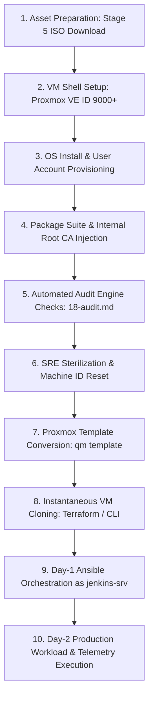

# 11 — HoRus Template Factory Lifecycle & Pipeline Stages

The lifecycle of a **HoRus Template** follows a strict, unidirectional progression from raw OS media to production VM instantiation, bridging Day 0, Day 1, and Day 2 operational phases (see [21-day0-day1-day2.md](./21-day0-day1-day2.md)).

---

## 🔄 The Template Factory Lifecycle Flow

---

## 📝 Lifecycle Stage Descriptions

### Stage 1: Asset Preparation
Installation ISOs (Debian netinst, Ubuntu live-server) and LXC base tarballs are downloaded, verified against SHA256 checksums, and placed in Proxmox storage during **Stage 5** of HoRus-Start.

### Stage 2: VM Shell Instantiation
A shell virtual machine (e.g. VM ID 9000) is created with standardized hardware configurations (1 vCPU, 1024 MiB RAM, VirtIO SCSI, Discard enabled, Host CPU flags). See [ADR-0007](../adr/ADR-0007-vm-id-allocation-scheme.md).

### Stage 3: OS Installation & Core Accounts
The operating system is installed in minimal headless mode. Administrative account (`abbenden-srv`), automation account (`jenkins-srv`), and service account (`docker-srv`) are created. Root password is locked. See [19-naming.md](./19-naming.md).

### Stage 4: Package & PKI Injection
The SRE core toolset, Fluent Bit log forwarder, Docker engine (for ID 9001), and internal Root CA certificate (`internal-ca.crt`) are installed and configured. See [ADR-0005](../adr/ADR-0005-pki-trust-distribution.md).

### Stage 5: Functional Automated Testing
Before sterilization, the candidate image undergoes validation against [18-audit.md](./18-audit.md) and [12-validation.md](./12-validation.md) to verify QEMU Agent response, SSH key logins, sudo privileges, and Docker socket permissions.

### Stage 6: SRE Sterilization & Machine ID Scrubbing
Unique runtime state is purged: APT cache is cleared, log files are truncated, bash history is erased, and `/etc/machine-id` is reset to force unique ID generation upon clone boot.

### Stage 7: Proxmox Template Conversion
The candidate VM is verified against [22-release-checklist.md](./22-release-checklist.md), powered off, and converted into a read-only Proxmox template (`qm template`).

### Stage 8: Instantaneous Cloning
Day-1 provisioning tools (Terraform or Proxmox CLI) execute full clones of the template into new VM instances in 3–5 seconds.

### Stage 9: Day-1 Ansible Orchestration
Upon boot, the new clone generates a fresh Machine ID and requests an IP address via DHCP. Ansible connects immediately as `jenkins-srv` using the pre-baked SSH key and applies workload roles. See [ADR-0003](../adr/ADR-0003-no-cloud-init.md).

### Stage 10: Production Workload Execution
The instance enters active production service monitored by Fluent Bit and QEMU Guest Agent.
