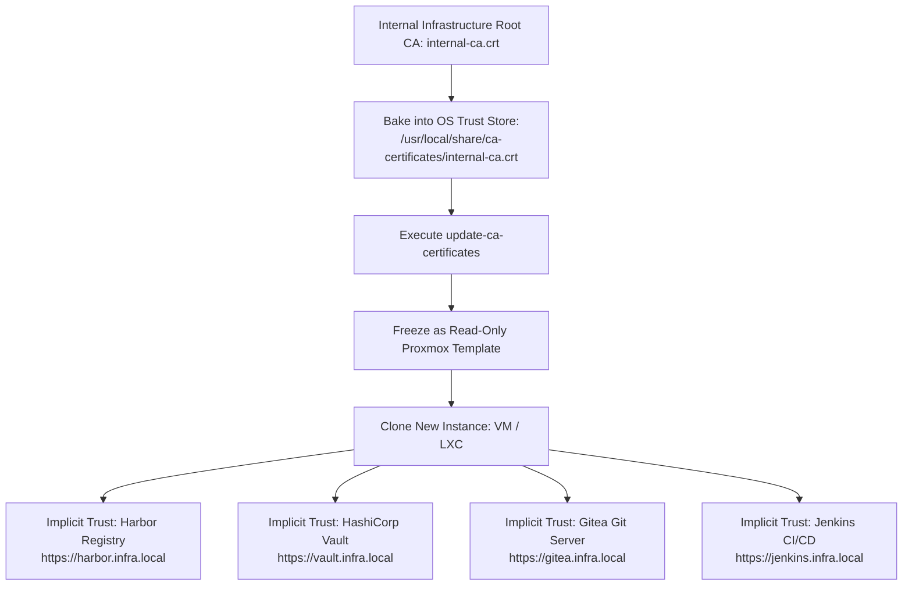

# 15 — PKI CA Certificate Distribution & Trust Pipeline

To ensure secure HTTPS/TLS communication across internal infrastructure without SSL verification errors or security bypasses (`curl -k`), every HoRus Template embeds the enterprise **Infrastructure Root CA Certificate**.

---

## 🏛️ PKI Certificate Flow Architecture



For formal architecture decision records regarding PKI certificate distribution, see [ADR-0005: Embedded Root CA Trust](../adr/ADR-0005-pki-trust-distribution.md) and [20-standards.md](./20-standards.md).

---

## 🛠️ Step-by-Step Certificate Injection into Template

### Step 1: Copy CA Certificate to OS Trust Store

Copy the internal Root CA certificate (`internal-ca.crt`) into the system trust store directory:

```bash
sudo cp internal-ca.crt /usr/local/share/ca-certificates/internal-ca.crt
sudo chmod 0644 /usr/local/share/ca-certificates/internal-ca.crt
```

### Step 2: Update System Certificate Trust Store

```bash
sudo update-ca-certificates
```

*Expected Output*:
```
Updating certificates in /etc/ssl/certs...
1 added, 0 removed; done.
Running hooks in /etc/ca-certificates/update.d...
done.
```

### Step 3: Verify TLS Trust

Test HTTPS connectivity against an internal service using `curl` without the `-k` (`--insecure`) flag:

```bash
curl -Iv https://vault.infra.local/v1/sys/health
# Output: SSL certificate verify ok.
```
