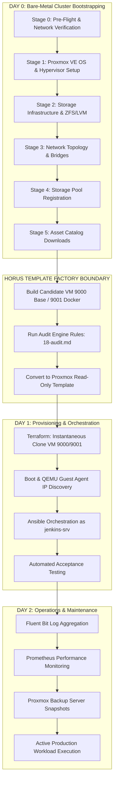

# 17 — Infrastructure Lifecycle Integration & End-to-End Pipeline

**HoRus Templates** do not exist in isolation. They form the foundational bridge between Day-0 bare-metal cluster bootstrapping and Day-1/Day-2 application orchestration in the **HoRus-Start** framework (see [21-day0-day1-day2.md](./21-day0-day1-day2.md)).

This document illustrates the end-to-end position of the **HoRus Template Factory** within the complete **Infrastructure Lifecycle**.

---

## 🗺️ End-to-End Infrastructure Lifecycle Flow

---

## 🔗 Interface Boundaries & Handoff Points

1. **Stage 5 ➔ Template Factory**: Stage 5 downloads the ISOs and LXC tarballs into `storage-infra/template/iso/`. The engineer or pipeline builds candidate templates using these downloaded assets.
2. **Template Factory ➔ Terraform Provisioning**: Terraform consumes template IDs `9000`, `9001`, or `9050` using the Proxmox Provider (`bpg/proxmox` or `telmate/proxmox`), performing full clones on local storage in seconds.
3. **Terraform ➔ Ansible Orchestration**: Once Terraform clones a VM and boots it, Ansible reads the VM's IP address reported by the QEMU Guest Agent via the Proxmox API, connects immediately as `jenkins-srv`, and configures the production role. See [ADR-0003](../adr/ADR-0003-no-cloud-init.md).
