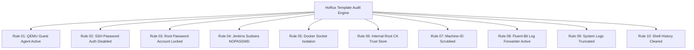

# 18 — Automated Audit Engine & Inspection Rules

To guarantee that every template produced by the **HoRus Template Factory** complies with system standards before being converted into a Proxmox template, the automated audit suite verifies 10 subsystem rules.

---

## 🔍 Automated Subsystem Audit Rules



---

## 📋 Inspection Execution Script Specification

The audit suite can be executed locally on the candidate VM or remotely via Ansible before template conversion:

```bash
#!/usr/bin/env bash
# HoRus Template Factory - Candidate Audit Script
set -eo pipefail

echo "=== [HoRus Audit Engine v2026.08] Starting Subsystem Checks ==="

# Rule 01: QEMU Guest Agent Active
if systemctl is-active --quiet qemu-guest-agent; then
    echo "[PASS] Rule 01: QEMU Guest Agent is active"
else
    echo "[FAIL] Rule 01: QEMU Guest Agent is NOT running" && exit 1
fi

# Rule 02: SSH Password Authentication Disabled
if grep -qE "^PasswordAuthentication no" /etc/ssh/sshd_config.d/*.conf 2>/dev/null || grep -qE "^PasswordAuthentication no" /etc/ssh/sshd_config; then
    echo "[PASS] Rule 02: SSH Password Authentication is disabled"
else
    echo "[FAIL] Rule 02: SSH Password Authentication is active" && exit 1
fi

# Rule 03: Root Account Locked
if passwd -S root | grep -qE "(L|!)"; then
    echo "[PASS] Rule 03: Root password account is locked"
else
    echo "[FAIL] Rule 03: Root account has an active password" && exit 1
fi

# Rule 04: Jenkins Passwordless Sudo
if sudo -u jenkins-srv sudo -n id &>/dev/null; then
    echo "[PASS] Rule 04: jenkins-srv possesses valid NOPASSWD sudo rights"
else
    echo "[FAIL] Rule 04: jenkins-srv sudo validation failed" && exit 1
fi

# Rule 05: Internal Root CA Embedded
if openssl verify /usr/local/share/ca-certificates/internal-ca.crt &>/dev/null; then
    echo "[PASS] Rule 05: Internal Root CA certificate is trusted"
else
    echo "[FAIL] Rule 05: Internal Root CA missing or untrusted" && exit 1
fi

# Rule 06: Machine ID Reset Check
if [ ! -s /etc/machine-id ]; then
    echo "[PASS] Rule 06: /etc/machine-id is 0 bytes (scrubbed)"
else
    echo "[FAIL] Rule 06: /etc/machine-id contains persistent ID" && exit 1
fi

# Rule 07: Log Truncation Check
VAR_LOG_SIZE=$(du -sm /var/log | cut -f1)
if [ "$VAR_LOG_SIZE" -le 2 ]; then
    echo "[PASS] Rule 07: /var/log size is under 2 MiB ($VAR_LOG_SIZE MiB)"
else
    echo "[WARN] Rule 07: /var/log size exceeds threshold ($VAR_LOG_SIZE MiB)"
fi

echo "=== [HoRus Audit Engine] ALL CRITICAL SUBSYSTEM AUDITS PASSED ==="
```
