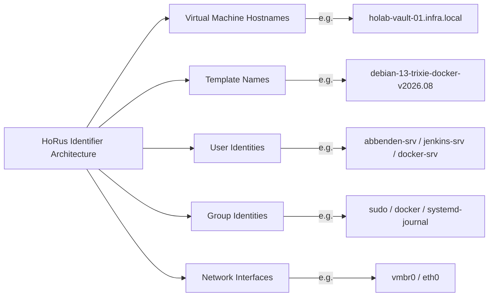

# 19 — System-Wide Naming Standards & Identifiers

To prevent ambiguity across Proxmox VE, DNS, Ansible, and Terraform, the **HoRus Template Factory** enforces strict naming standards.

---

## 🏷️ System-Wide Naming Convention Matrix

---

## 📋 Comprehensive Identifiers Catalog

### 1. Virtual Machine & Hostname Standard
- **Format**: `<cluster_prefix>-<service_role>-<instance_id>.<domain>`
- **Examples**:
  - `holab-vault-01.infra.local`
  - `holab-gitea-01.infra.local`
  - `holab-harbor-02.infra.local`
  - `holab-jenkins-01.infra.local`

### 2. Template Name Standard
- **Format**: `<os>-<release>-<archetype>-v<year>.<month>`
- **Examples**:
  - `debian-13-trixie-base-v2026.08`
  - `debian-13-trixie-docker-v2026.08`
  - `ubuntu-2404-noble-base-v2026.08`
  - `tpl-debian-13-lxc-v2026.08`

### 3. User Identities Standard
| Username | Account Role | Login Shell | Home Directory | Privilege Level |
| :--- | :--- | :--- | :--- | :--- |
| `root` | OS Kernel Master | `/bin/bash` | `/root` | Full System Root (Password Locked) |
| `abbenden-srv` | Human Admin | `/bin/bash` | `/home/abbenden-srv` | Passworded Sudo / Ed25519 Key |
| `jenkins-srv` | Automation / Ansible | `/bin/bash` | `/home/jenkins-srv` | `NOPASSWD: ALL` / Ed25519 Key |
| `docker-srv` | Container Runtime | `/bin/bash` | `/home/docker-srv` | Unprivileged / `docker` group |

### 4. Group Identities Standard
- `sudo`: System administration privilege delegation.
- `docker`: Unprivileged UNIX socket access for container execution (`docker-srv` and `jenkins-srv`).
- `systemd-journal`: System log reading access for telemetry services (Fluent Bit).

### 5. Network Interfaces Standard
- `vmbr0`: Linux bridge interface on Proxmox VE host providing management and VM LAN access.
- `eth0`: Primary virtual network adapter inside Linux VMs and LXC containers.
