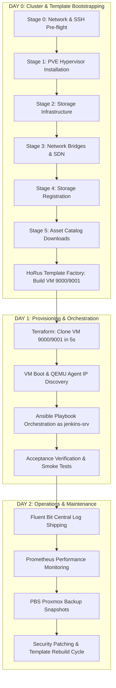

# 21 — Day-0 / Day-1 / Day-2 Operational Lifecycle Framework

The **HoRus Template Factory** structures infrastructure operations into three distinct, non-overlapping phases: **Day 0**, **Day 1**, and **Day 2**.

---

## 🗺️ Day-0 / Day-1 / Day-2 Architecture Flow

---

## 📋 Operational Phase Responsibilities

### Day 0: Bare-Metal Bootstrapping & Template Factory
- **Goal**: Transform bare-metal hardware into an operational Proxmox cluster and build frozen, SRE-hardened OS templates (`VM ID 9000+`).
- **Tooling**: HoRus-Start Ansible Playbooks (Stages 0–5) & HoRus Template Factory assembly.
- **Output**: Functional Proxmox VE cluster with `storage-infra` holding ready-to-clone templates.

### Day 1: Automated Provisioning & Configuration
- **Goal**: Instantiate new virtual machines or LXC containers for specific application workloads.
- **Tooling**: Terraform Proxmox Provider + Ansible Configuration Management.
- **Output**: Fully configured microservices (Vault, Harbor, Gitea, Jenkins) running on cloned instances.

### Day 2: Production Operations & Lifecycle Maintenance
- **Goal**: Maintain system health, monitor performance, collect logs, manage backups, and execute zero-downtime template updates.
- **Tooling**: Fluent Bit, Prometheus, Proxmox Backup Server (PBS), and Template Rebuild Pipeline.
- **Output**: High-availability, self-healing infrastructure.
