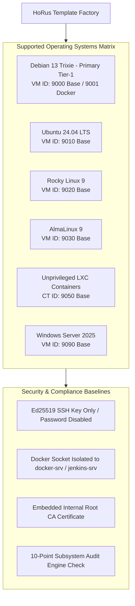

# HoRus-Start — HoRus Template Factory Engineering Specification

Welcome to the **HoRus Template Factory** enterprise engineering specification suite for the HoRus-Start platform.

In accordance with the **v2.0-RC1 Architecture Freeze**, automated HoRus-Start playbooks conclude after **Stage 5 (Asset Preparation & Validation)**. The assembly of custom OS infrastructure templates (VM ID 9000 Base, VM ID 9001 Docker, Multi-OS targets, and LXC container templates) is performed according to the HoRus Template Factory specification documented here.

---

## 🏛️ Template Factory High-Level Architecture



---

## 📚 Complete Engineering Documentation Index

| File | Topic | Description |
| :--- | :--- | :--- |
| **[00-philosophy.md](./00-philosophy.md)** | **Core Architecture Philosophy** | Rationale behind Template Factory: determinism, reproducibility, zero post-creation drift. |
| **[01-prerequisites.md](./01-prerequisites.md)** | **Prerequisites & Multi-OS Scope** | Requirements, ISO media catalog, multi-OS support (Debian, Ubuntu, Rocky, Alma, Windows). |
| **[02-debian-9000-base.md](./02-debian-9000-base.md)** | **Base Template Assembly (ID 9000)** | Step-by-step creation of `debian-13-trixie-base` and multi-OS standards. |
| **[03-debian-9001-docker.md](./03-debian-9001-docker.md)** | **Docker Engine Template (ID 9001)** | `debian-13-trixie-docker` build with tuned `/etc/docker/daemon.json` & socket isolation. |
| **[04-lxc-templates.md](./04-lxc-templates.md)** | **LXC Container Templates** | Building unprivileged LXC templates with `nesting`, `keyctl`, and `fuse` feature flags. |
| **[05-sre-packages.md](./05-sre-packages.md)** | **SRE Package Manifest & "Why"** | Deep dive breakdown for every utility and API/automation use case. |
| **[06-jenkins-access.md](./06-jenkins-access.md)** | **Jenkins / Ansible Access** | `jenkins-srv` user setup, passwordless sudoers, SSH key deployment, and ACLs. |
| **[07-ssh-keys.md](./07-ssh-keys.md)** | **SSH Security & Key Management** | Ed25519 key generation, strict permissions (`700`/`600`), and Windows PowerShell tips. |
| **[08-hardening.md](./08-hardening.md)** | **OS Security Baseline** | Root locking, SSH daemon parameters, kernel sysctl tuning, and socket isolation. |
| **[09-template-cleanup.md](./09-template-cleanup.md)** | **SRE Sterilization & Freeze** | Machine ID reset, log truncation, bash history scrubbing, and Proxmox conversion. |
| **[10-known-problems.md](./10-known-problems.md)** | **Known Issues & Solutions Log** | Problem registry, GPG verification fixes, root cause analysis, and battle-tested fixes. |
| **[11-lifecycle.md](./11-lifecycle.md)** | **Template Lifecycle Map** | 10-stage unidirectional progression from raw ISO to production VM clone. |
| **[12-validation.md](./12-validation.md)** | **Validation Checklist** | Audit matrix verifying QEMU agent, SSH keys, sudo, PKI, and Docker socket. |
| **[13-recovery.md](./13-recovery.md)** | **Template Recovery & Rebuild** | The Rebuild Doctrine: "Never repair corrupted templates — destroy and rebuild from source". |
| **[14-security-baseline.md](./14-security-baseline.md)** | **Security Posture Baseline** | Mandatory SSH config rules (`PermitRootLogin no`), UFW firewalling, and auditd logging. |
| **[15-pki.md](./15-pki.md)** | **PKI Trust Distribution** | Embedding internal Root CA (`internal-ca.crt`) into OS trust store for zero-trust TLS. |
| **[16-versioning.md](./16-versioning.md)** | **Template Versioning & Naming** | Naming standards (`9000-v2026.08`) and `/etc/horus-template-release` metadata file. |
| **[17-pipeline-integration.md](./17-pipeline-integration.md)** | **Infrastructure Lifecycle Map** | Position of Template Factory across Day-0, Day-1 (Terraform/Ansible), and Day-2 ops. |
| **[18-audit.md](./18-audit.md)** | **Automated Audit Engine** | Subsystem rules (QEMU, SSH, Root Lock, Sudo, PKI, Log size) & verification script. |
| **[19-naming.md](./19-naming.md)** | **System-Wide Naming Standards** | Naming rules for VMs, templates, service users (`abbenden-srv`/`jenkins-srv`), and networks. |
| **[20-standards.md](./20-standards.md)** | **Standards Catalog** | Single-source-of-truth catalog for Disks, Networking, PKI, Logs, Security, and Docker. |
| **[21-day0-day1-day2.md](./21-day0-day1-day2.md)** | **Day-0/Day-1/Day-2 Framework** | Operational map connecting cluster bootstrapping, VM provisioning, and Day-2 ops. |
| **[22-release-checklist.md](./22-release-checklist.md)** | **Release Readiness Checklist** | Interactive release readiness checklist for template candidates prior to freeze. |
| **[23-security-matrix.md](./23-security-matrix.md)** | **Security Capability Matrix** | Component privilege levels, authentication types, socket permissions, and firewall rules. |

---

## 🏛️ Architecture Decision Records (ADR Index)

| ADR File | Title | Status |
| :--- | :--- | :--- |
| **[ADR-0001](../adr/ADR-0001-template-factory.md)** | HoRus Template Factory Architecture | **Accepted** |
| **[ADR-0002](../adr/ADR-0002-docker-user-isolation.md)** | Docker Daemon Socket Security & User Isolation | **Accepted** |
| **[ADR-0003](../adr/ADR-0003-no-cloud-init.md)** | Direct QEMU Guest Agent & Ansible Integration over Cloud-Init | **Accepted** |
| **[ADR-0004](../adr/ADR-0004-ssh-key-authentication.md)** | Strict Ed25519 SSH Key-Only Authentication & Locked Root | **Accepted** |
| **[ADR-0005](../adr/ADR-0005-pki-trust-distribution.md)** | Embedded Infrastructure Root CA Trust Distribution | **Accepted** |
| **[ADR-0006](../adr/ADR-0006-lxc-unprivileged-strategy.md)** | Unprivileged LXC Container Strategy & Feature Flags | **Accepted** |
| **[ADR-0007](../adr/ADR-0007-vm-id-allocation-scheme.md)** | VM ID Partitioning & Deterministic Allocation Scheme | **Accepted** |

---

## 🎯 Resulting Template Catalog

Executing this documentation produces the following standardized infrastructure templates:

```
Proxmox VE Cluster HoRus Template Catalog
├── [Template ID 9000] debian-13-trixie-base-v2026.08
│   ├── Clean Debian 13 (Trixie) Minimal Installation
│   ├── QEMU Guest Agent & SRE Package Suite
│   ├── Embedded Internal Root CA Trust Store
│   ├── Fluent Bit Log Forwarder Service
│   ├── Admin User: abbenden-srv (Passwordless SSH)
│   └── Automation User: jenkins-srv (Passwordless Sudo & Ed25519 Key)
│
├── [Template ID 9001] debian-13-trixie-docker-v2026.08
│   ├── All features inherited from Template 9000
│   ├── Docker CE Engine with Production /etc/docker/daemon.json
│   └── Service User: docker-srv (Isolated Docker Socket Access)
│
├── [Template ID 9010] ubuntu-2404-noble-base-v2026.08 (Ubuntu Server 24.04 LTS)
├── [Template ID 9020] rocky-9-minimal-base-v2026.08 (Rocky Linux 9 Minimal)
├── [Template ID 9030] almalinux-9-minimal-base-v2026.08 (AlmaLinux 9 Minimal)
│
└── [LXC Container Templates]
    ├── [Template ID 9050] tpl-debian-13-lxc-v2026.08 (Unprivileged, Nesting, Keyctl, FUSE)
    ├── [Template ID 9051] tpl-ubuntu-2404-lxc-v2026.08 (Unprivileged, Nesting, Keyctl, FUSE)
    └── [Template ID 9052] tpl-alpine-320-lxc-v2026.08 (Ultra-lightweight Microservice Base)
```
